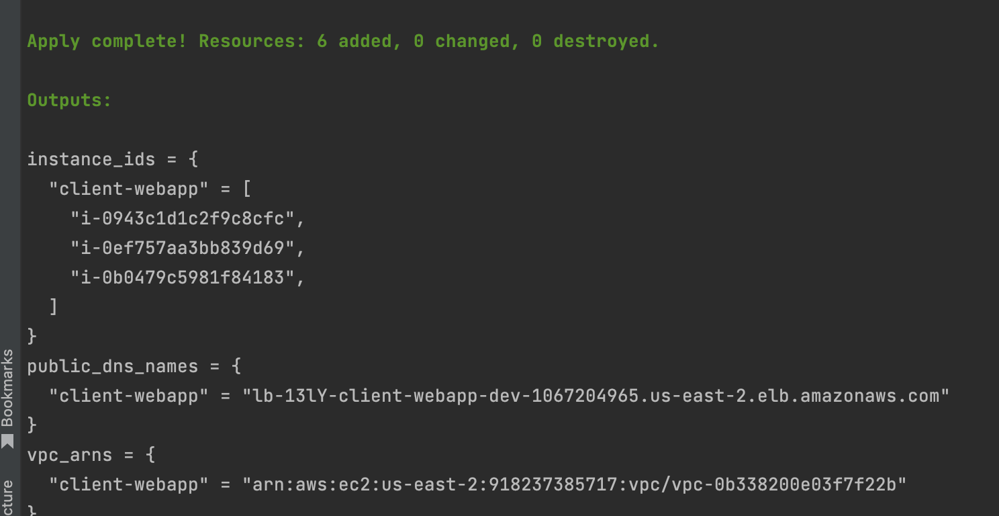
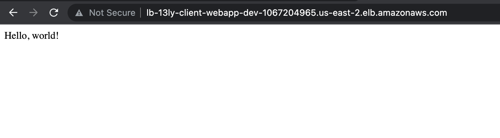

# Terraform-Aleksei-Izbrodin
Created 3 ec-2 with ELB and Apache inside

Result:

<!-- BEGINNING OF PRE-COMMIT-TERRAFORM DOCS HOOK -->
## Requirements

| Name | Version |
|------|---------|
|  [terraform](#requirement\_terraform) | ~> 1.2 |
|  [aws](#requirement\_aws) | ~> 4.22.0 |

## Providers

| Name | Version |
|------|---------|
|  [aws](#provider\_aws) | 4.22.0 |
|  [random](#provider\_random) | 3.4.3 |

## Modules

| Name | Source | Version |
|------|--------|---------|
|  [app\_security\_group](#module\_app\_security\_group) | terraform-aws-modules/security-group/aws//modules/web | 4.9.0 |
|  [ec2\_instances](#module\_ec2\_instances) | ./modules/ec-2 | n/a |
|  [elb\_http](#module\_elb\_http) | terraform-aws-modules/elb/aws | 3.0.1 |
|  [lb\_security\_group](#module\_lb\_security\_group) | terraform-aws-modules/security-group/aws//modules/web | 4.9.0 |
|  [vpc](#module\_vpc) | terraform-aws-modules/vpc/aws | 3.14.2 |

## Resources

| Name | Type |
|------|------|
| [aws_flow_log.example](https://registry.terraform.io/providers/hashicorp/aws/latest/docs/resources/flow_log) | resource |
| [random_string.lb_id](https://registry.terraform.io/providers/hashicorp/random/latest/docs/resources/string) | resource |
| [aws_availability_zones.available](https://registry.terraform.io/providers/hashicorp/aws/latest/docs/data-sources/availability_zones) | data source |

## Inputs

| Name | Description | Type | Default | Required |
|------|-------------|------|---------|:--------:|
|  [aws\_region](#input\_aws\_region) | AWS region for all resources. | `string` | `"us-east-2"` | no |
|  [iam\_role\_name](#input\_iam\_role\_name) | Name to use on IAM role created. | `string` | `null` | no |
|  [log\_destination](#input\_log\_destination) | Log destination. | `string` | `null` | no |
|  [private\_subnet\_cidr\_blocks](#input\_private\_subnet\_cidr\_blocks) | Available cidr blocks for private subnets. | `list(string)` | <pre>[   "10.0.101.0/24",   "10.0.102.0/24",   "10.0.103.0/24",   "10.0.104.0/24",   "10.0.105.0/24",   "10.0.106.0/24",   "10.0.107.0/24",   "10.0.108.0/24",   "10.0.109.0/24",   "10.0.110.0/24",   "10.0.111.0/24",   "10.0.112.0/24",   "10.0.113.0/24",   "10.0.114.0/24",   "10.0.115.0/24",   "10.0.116.0/24" ]</pre> | no |
|  [project](#input\_project) | Map of project names to configuration. | `map(any)` | <pre>{   "client-webapp": {     "environment": "dev",     "instance_type": "t2.micro",     "instances_per_subnet": 3,     "private_subnets_per_vpc": 1,     "public_subnets_per_vpc": 1   } }</pre> | no |
|  [public\_subnet\_cidr\_blocks](#input\_public\_subnet\_cidr\_blocks) | Available cidr blocks for public subnets. | `list(string)` | <pre>[   "10.0.1.0/24",   "10.0.2.0/24",   "10.0.3.0/24",   "10.0.4.0/24",   "10.0.5.0/24",   "10.0.6.0/24",   "10.0.7.0/24",   "10.0.8.0/24",   "10.0.9.0/24",   "10.0.10.0/24",   "10.0.11.0/24",   "10.0.12.0/24",   "10.0.13.0/24",   "10.0.14.0/24",   "10.0.15.0/24",   "10.0.16.0/24" ]</pre> | no |
|  [vpc\_cidr\_block](#input\_vpc\_cidr\_block) | CIDR block for VPC. | `string` | `"10.0.0.0/16"` | no |

## Outputs

| Name | Description |
|------|-------------|
|  [instance\_ids](#output\_instance\_ids) | IDs of EC2 instances. |
|  [public\_dns\_names](#output\_public\_dns\_names) | Public DNS names of the load balancers for project. |
|  [vpc\_arns](#output\_vpc\_arns) | ARNs of the vpcs for each project. |
<!-- END OF PRE-COMMIT-TERRAFORM DOCS HOOK -->
